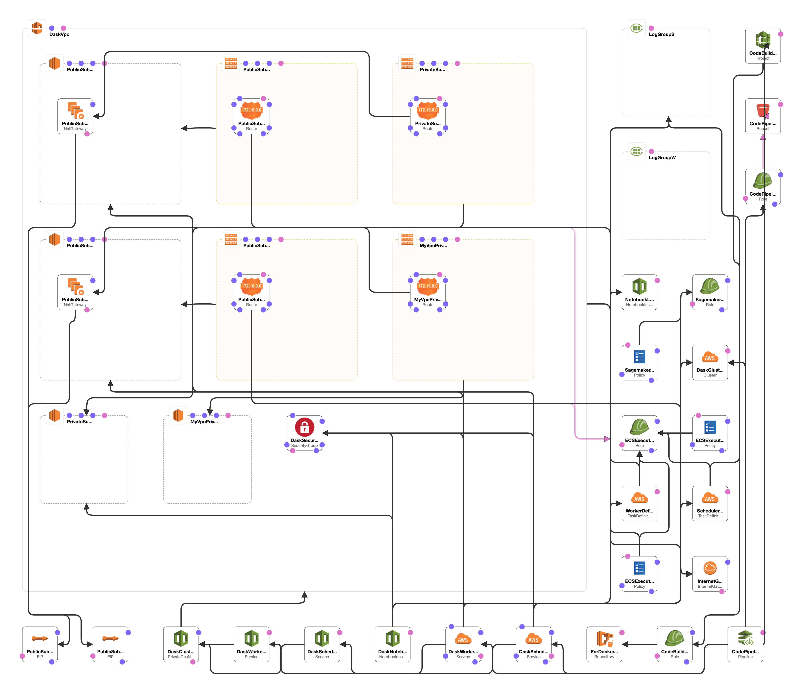

Working with ERA5 using Dask and AWS Fargate
============================================

This example uses AWS CloudFormation to create an Amazon SageMaker Jupyter Notebook and AWS Fargate cluster for using Dask for distributed computation over large data volumes.

The Jupyter notebook shows an example of how to use Dask to load netcdf files directly from S3. The mean and standard deviation of the loaded data are then computed to demonstrate how Dask can be used to accelerate computations over large data volumes. Finally, time series are pulled from the loaded data to demonstrate how to select specific locations in a raster field.

### Architecture

